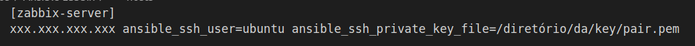

# Installation

#### Step 1: Ansible Installation

**Note 1:** Compatible procedure to run on Ubuntu 20.04 or higher.

**Note 2:** Ansible is based on the **_Python_** programming language, so you need to have some version of _Python_ installed on your machine (if possible, the most recent version).

To check if you already have a version installed, simply open your operating system shell and type:

```sh
$ python --version
```

If you do not have any version installed, you can follow the installation steps in this **[link](https://python.org.br/instalacao-linux/ "Instalação do Python")**.

- **To install Ansible, follow the following commands:**

```sh
$ sudo apt update
$ sudo apt install software-properties-common
$ sudo add-apt-repository --yes --update ppa:ansible/ansible
$ sudo apt install ansible
```

---

#### Passo 2: Create an EC2 on AWS


[How to create an EC2](https://docs.aws.amazon.com/pt_br/AmazonRDS/latest/UserGuide/CHAP_Tutorials.WebServerDB.CreateWebServer.html "AWS")

To create an EC2, follow the steps in the link _above_, and change the settings as needed.

**Note 3:** Download the key pair and save it in a folder that you remember where it is, as you will need it later.

---
#### Step 3: Ansible Configuration

When you finish creating an EC2 and after installing Ansible _on your machine_, clone this repository, enter this folder and open VSCode to change some settings in the ansible.cfg, hosts and common files.

- **Follow the procedures below to clone the repository:**

**Observação 4:** We will use Visual Studio Code to edit the code, if you don't have it installed, just follow the steps in this[link](https://linuxize.com/post/how-to-install-visual-studio-code-on-ubuntu-20-04/ "Instalar VSCode")
You can use VIM or some other editor of your choice.

```sh
$ git clone git@github.com:frovai/Auto-Registration-ZabbixURLs.git
$ cd Auto-Registration-ZabbixURLs
$ code . 
```

This last command will open VSCode.

**Note 5:** The files are filled out to make your work easier, **pay attention to places where you should change any data.**

- The **_ansible.cfg_** file is complete, you will not need to change anything, only if you find it necessary.

- In the **_hosts_** file you will need to change the _IP number_ of the machine where Zabbix will be installed and the key directory that you created when uploading an EC2.
If you want, you can change the identification name in brackets.




>  **xxx.xxx.xxx.xxx** -> here you enter the IP of the EC2 that you uploaded.

>  **/directory/of/key/pair.pem** -> Here you will enter the directory where you saved your key pair generated when creating EC2.

- On the file **zabbix_server.yml** you will mess up if you changed the name (the one in brackets) in the **hosts** file.

---

#### Step 4: Changing some data in the Code

- To change the password that MySQL will use, access the files below and change the password in front of the equal symbol:

**roles/zabbix_server/tasks/files/zabbix.conf.php**
```$DB['PASSWORD'] = ```

**roles/zabbix_server/tasks/files/zabbix_server.conf**
```DBPassword=```

- **Note 5:** Do not commit these files with the password that will be used.

--- 

#### Step 5: Start Installing Zabbix 6.2

- Open the terminal on your machine in the folder where the **zabbix_server.yml** file is and type:

```sh
$ ansible-playbook zabbix_server.yml
```

Ansible will execute all the commands and then perform the installation (it takes about 5 minutes to complete the installation).

# CI/CD

In this project, a pipeline was implemented to automate interactions with Zabbix via API, such as creating, deleting and editing Webchecks and Triggers. This documentation will explain how each stage of the pipeline works and teach you how to use it.

It is worth mentioning that all stages of this pipeline are manual, so they must be executed as needed.

The stages and the pipeline is described in file **.github/workflows/zabbix_action.yml**

### Job registre_url_create_trigger

This is the stage responsible for creating **Webchecks** and **Triggers**.

**Interactions**
- Fill in the list of URLs in the file **files_url/urlsZabbix.txt** to which you want to create the Webchecks and Alarm Triggers and leave them committed in the repository.

**Operation**
 - The **scripts_config_zabbix/registre_url_zabbix.sh** script is executed and then the **scripts_config_zabbix/create_trigger_zabbix.sh** script is executed.
 - The scripts for interacting with the API always follow the same structure. First, a GET is performed to obtain an access token and use it to authorize other requests to the API.
 - Then a POST is made to the Zabbix API creating the Webchecks.
 - The process is repeated for the Trigger creation script.
 - Creation of Webchecks and Triggers completed!

---

### Job update_webchecks

At this stage it is possible to perform an update to edit the Webchecks time interval.
This interval defines how often Zabbix will check the URL.

**Interactions**
- It is necessary to fill in the file **files_url/urlsIntervalUpdate.txt** before executing the stage.
- The file must only be filled with the DNS separated by a comma and the time with "s" or "m" for minutes, such as:


```sh
website1.MYDOMAIN.com.br,1m
website2.MYDOMAIN.com.br,40s
```

- **DO NOT put spaces separating the URL from the time range. To work correctly, everything must be together, with just the comma as a separator between the URL and the time**
- The time must contain an "m" as shown in the example to define the time unit in minutes.
- It is important to note that this file will be used to control URLs that have a different range, so **DO NOT** delete the URLs that are already registered in it, just add the desired URL at the end of the file following the pattern passed previously.
- Then the stage must be manually executed.

**Operation**
- The pipeline runs the script **scripts_config_zabbix/update_webchecks_zabbix.sh**.
- This script runs on top of the file list **files_url/urlsIntervalUpdate.txt**, taking the URLs and their respective interval times.
- The structure of the script is similar to the previous one, with the difference that it performs a GET on the Zabbix API, passing the URL as a filter, to receive the ID of that URL within Zabbix.
- Then the script makes a POST passing the URL ID that was obtained in the previous step and the interval time defined in the file
so that the URL Webcheck can be updated.
- At the end, the Webcheck that already existed will have its interval time changed to the desired one.

---

### Job delete_webchecks

This stage deletes WebChecks and Triggers from URLs in the file **files_url/urlsToDelete.txt**

**Interactions**
- It is necessary to fill out the file **files_url/urlsToDelete.txt** before executing the job.
- The file must be filled with DNS only, as shown in the example below:

```sh
test-zabbix-url.MYDOMAIN.com.br
```

- This file must contain **ONLY** the URLs to be **DELETED**, therefore, every time it is necessary to run this job, you must clean the URLs that were previously there and add new ones that should be deleted from Zabbix.
- Then the job must be executed manually.

**Operation**
- The pipeline runs the script **scripts_config_zabbix/delete_webchecks_zabbix.sh**.
- The script loops through the file list **files_url/urlsToDelete.txt**.
- The structure of the script is the same as the previous job, but instead of updating the store ID, it deletes it, erasing the Webcheck and the Trigger associated with that URL.

---

# Troubleshooting

Para troubleshooting , necessário buscar nos logs da aplicação e serviços adjacentes a ela nos caminhos:

**/var/log/nginx/*.log**
**/var/log/mysql/*.log**
**/var/log/zabbix/*.log**
**/var/log/php8.1-fpm.log**
**/var/log/syslog**
